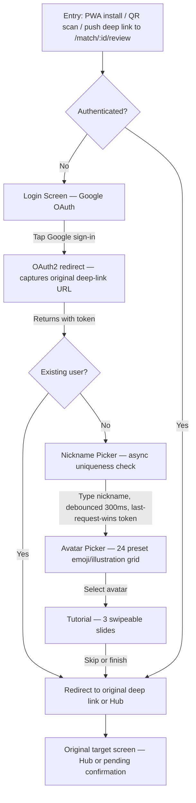

# UX Design Specification Tic-Tac-Tore

**Author:** Pavel
**Date:** 2026-04-08

---

## Executive Summary

### Project Vision

Tic-Tac-Tore transforms office foosball from an ephemeral pastime into a data-driven competitive experience. The platform records matches, verifies results through opponent confirmation, and produces positional statistics deep enough to reveal skill differences invisible to the naked eye — creating a new layer of office culture built on verified data, shared team history, and friendly rivalry.

The product consolidates match recording, verified statistics, social matchmaking ("Want to Play" pools), and tournament management into a single mobile-first PWA — replacing the current reality where games are played, forgotten, and endlessly debated. Two match entry modes serve different moments: retrospective entry for quick post-game logging (<10 seconds), and live mode where the phone placed flat on the table becomes both a scoreboard and a goal-by-goal protocol.

The app serves the physical world — not every player at the table needs a phone. One person records, others confirm later via push notifications. This asymmetric model removes pressure for group device synchronization and matches how office foosball actually works.

No existing product in the market offers positional statistics (attack vs. defense performance), multi-rule-system support (ITSF, DTFB, custom house rules), or integrated tournament management with statistical continuity.

### Target Users

**Primary audience:** 10–20 office foosball players at itemis GmbH — a mix of casual and competitive players motivated by friendly rivalry and personal improvement. Tech-savvy (software engineers), smartphone-first usage during work breaks.

**Audience priority:** The app is built for enthusiasts first — players who play regularly and want to see dimensions of their game invisible without statistics. Casual and social players are welcome and accommodated, but do not drive core design decisions.

**User archetypes (ordered by design priority):**

| Archetype | Core Need | UX Implication | Priority |
|-----------|-----------|----------------|----------|
| **The Competitor** (Max) | Prove skill with data, compare H2H | Deep positional stats, sortable leaderboards, H2H cross-tabulation, share button | Primary |
| **The Referee** (Viktor) | Record matches efficiently during tournaments | Portrait referee view, live mode, streamlined per-match flow | Primary |
| **The Organizer** (Oleg) | Run tournaments without spreadsheets | Self-service tournament creation, fully autonomous after setup | Primary |
| **The Newcomer** (Kai) | Organic, zero-friction onboarding | Confirmation-first experience, tutorial slides, demo data (FR57) | Secondary |
| **The Social Player** (Lisa) | Find games without social friction | Want to Play pools, push notifications, minimal interaction | Secondary |
| **The Achievement Hunter** (Anna) | Collect badges and share stories | Award wall, narrative achievements, sequential rollout (Phase 4+) | Future |

**Frequency-based action prioritization:**

| Action | Frequency | Entry Point |
|--------|-----------|-------------|
| Record match | Daily, multiple times | In-app: Home Hub → New Match |
| Want to Play (create/join pool) | Several times per day/week | In-app: Home Hub → Want to Play (Phase 2) |
| Confirm match | Daily | 90% via push notification deep link; in-app badge as fallback |
| View statistics | Several times per week | In-app: Home Hub → Statistics |
| Create tournament | Monthly, then autonomous | In-app: one-time action |

### Key Design Challenges

1. **Orientation follows physical context.** Retrospective match entry stays in portrait — the standard phone-in-hand posture — eliminating the forced rotation that would consume 3–5 seconds of the 10-second budget. Landscape orientation is reserved exclusively for Live Match mode (Phase 1.5), where the phone physically lies on the table and the screen maps to the playing field. The kicker table visual metaphor (team colors, player positioning, field aesthetics) is carried into portrait through iconography and layout, not forced orientation change.

2. **Speed as survival metric.** Retrospective match entry must complete in under 10 seconds end-to-end. Rules and team defaults pre-set from last used configuration. Player slots start empty (not pre-filled — verifying pre-filled names is slower than filling blanks). Frequent opponents prioritized at top of player selection lists.

3. **Confirmation without bureaucracy.** Single-tap confirmation replaces the double-check flow (PRD FR13 override). Triple insurance model: 1 submitter + 2 confirmers = sufficient protection. After confirmation, a 15-second undo toast provides misclick protection without blocking flow. Rich push notifications show match details (players, scores) so users can decide before opening the app.

4. **Multi-rule system without cognitive overload.** ~2,500 possible parameter combinations collapse to 2–3 active templates per player group (KD-04). The UI shows familiar template names (ITSF, DTFB, "Friday Night Fun"), never raw parameters. Template creation is a power-user flow, not a default path. Rule sharing: ability to save a rule template from a played game, enabling organic rule propagation between players.

5. **Progressive complexity for the entire interface.** Statistical depth follows progressive disclosure: casual users see simple win/loss; engaged users discover positional breakdowns; power users filter by exact rule configuration. This principle extends beyond statistics to every screen — the interface reveals complexity as the user demonstrates engagement, never upfront.

6. **Home Hub: predictable, focused, evolving.** Home Hub is always the start screen on normal app launch — predictability over cleverness. Muscle memory matters: the user's finger is already hovering before the screen loads. MVP: 2–3 primary buttons (New Match, Statistics, Played Matches). Phase 2 adds Want to Play. Phase 3 adds Tournaments. Each phase organically adds one button — the Hub grows with the product. Push notifications are the only exception — they deep link to the relevant screen.

7. **Self-service, zero-admin as design principle.** The platform operates without an admin role. Tournaments run fully autonomously after creation — deadline enforcement, technical defeats, bracket progression, completion. Match confirmation is peer-to-peer. Abuse prevention is automated rate-limiting. Every screen and flow must be designed for self-service operation.

8. **Casual-friendly tone of voice.** Button labels and screen names should feel inviting, not analytical. Consider renaming "Statistics" → "My Game", "Leaderboards" → contextual fun names. The language should say "this is fun", not "this is serious." Requires a dedicated naming brainstorm session.

9. **Kicker table metaphor: functional where it matters, ambient elsewhere.** The table-top visual metaphor is functionally critical in live mode (screen corners = player positions). In all other screens, the foosball identity lives through the design system (dark theme, green/red/yellow palette, Space Grotesk/Manrope typography) — not through forced table layouts. Screens are what they need to be: forms, tables, cards — in brand colors.

### Design Opportunities

1. **Live mode as augmented reality for foosball.** Phone flat on the table during play, screen corners mapped to player positions, one tap per goal — the physical and digital game merge. This is the feature that makes first-time observers say "what is that app?" and creates organic adoption.

2. **Statistics as recognition engine.** Every player finds at least one dimension where they excel. The depth of positional analytics means nobody is "just average" — there is always a hidden strength to discover. For Phase 4+, achievements become narrative artifacts — not just badges, but stories: when it was earned, which matches contributed, how the player compares to others who earned it. Achievement rollout should be sequential (core badges first → narrative layer → meta-statistics).

3. **Proactive insights without navigation.** Rank movement displayed on Home Hub — entered/exited top-10, milestone movements (top-50, top-40, top-30). H2H comparison limited to favorites/teams (10-15 players max, performance to be validated with architect). Users discover statistics passively through contextual micro-insights, not only through dedicated statistics screens.

4. **Micro-celebration after confirmation.** Every match confirmation triggers an instant insight — "Your win streak: 4 matches", "You're now #3 in defense ranking." Transforms a routine obligation into a micro-reward moment. Minimal dev cost, maximum emotional impact.

5. **Team history as social glue.** Pair-level statistics create conversational hooks between teammates: "apparently we're unbeatable together" drives social bonding beyond the match itself.

6. **Hall of Fame and native sharing.** MVP: share button on statistics screens via Web Share API (zero backend). Phase 4: personal "Hall of Fame" gallery — curated stat highlights and achievement moments. Other players view someone's Hall of Fame via long-press on avatar → fullscreen slideshow. Statistics transform from private data into social currency.

7. **Skill-level matchmaking.** "Want to Play" pools and tournaments support optional skill-level restrictions — minimum and/or maximum thresholds. This serves both directions: professionals training seriously can exclude mismatched opponents, and — equally important — newcomers see an explicit signal that a pool welcomes their level. Without level labels, a newcomer may self-exclude from any pool, assuming "everyone there is a pro and won't enjoy playing with me." A pool labeled "all levels welcome" or "max level: intermediate" is an invitation, not just a filter.

8. **Activity feed on Home Hub.** Compact match feed below primary buttons — last 3-5 matches in the group. Social proof that games are happening, FOMO for casual players, context without navigation. Scrollable area under fixed action buttons.

9. **Avatar as universal interaction point.** Tap on avatar anywhere (leaderboard, match card, player list) → quick stats popup. Long-press → profile / Hall of Fame (Phase 4). One element, consistent behavior everywhere. Design principle: "avatar is always interactive."

### Design Decisions Log

| Decision | Rationale | PRD Impact |
|----------|-----------|------------|
| Portrait for retrospective entry | Speed > visual metaphor; phone in hand = portrait | Overrides landscape assumption from mockups |
| Remove double-check, add undo toast | Triple insurance sufficient; undo toast = misclick protection without bureaucracy | Overrides FR13 |
| Home Hub always the start screen | Predictability > contextual smartness; muscle memory | Confirms PRD intent |
| Teams & Rules: no dedicated screen | All management inline during match creation or in Settings; no standalone admin screen | Simplifies navigation |
| Played Matches + Confirmation Queue → unified "My Matches" | Users think "my matches", not "history" vs "queue" | Simplifies navigation |
| Player list: frequent opponents at top, not pre-filled | Empty slots faster than verifying/replacing pre-filled names | Refines match entry UX |
| Hub evolves by phase | MVP: 2-3 buttons; Phase 2: +Want to Play; Phase 3: +Tournaments | Phased UI growth |
| App serves the physical world | Not every player needs a phone at the table; one records, others confirm via push | Core design principle |

## Core User Experience

### Defining Experience

The core experience of Tic-Tac-Tore is a three-stage loop that must feel like a single continuous motion:

**Record → Confirm → Discover**

1. **Record:** One player captures the match result in under 10 seconds. This is the atomic action — without it, nothing else exists. The recording flow must be so fast that it becomes part of the post-match ritual, like shaking hands after a game.

2. **Confirm:** Opponents validate the result with a single tap from a push notification. This is a reactive, near-zero-effort action. The push notification contains enough context (players, scores) to make a decision without opening the app.

3. **Discover:** Statistics reveal hidden dimensions of the player's game. This is the reward — the reason the first two steps matter. Discovery happens both actively (navigating to statistics) and passively (micro-insights on Home Hub, post-confirmation celebrations).

The loop is asymmetric by design: one person records (proactive effort), multiple people confirm (reactive, minimal effort), and everyone benefits from discovery (passive reward). This matches the physical reality of office foosball — one person takes responsibility, everyone participates.

**The critical interaction to get right:** Match recording. If recording is too slow, too complex, or too many steps — players say "I'll do it later" and never do. Every match lost to friction is data that never enters the system, weakening statistics for everyone. Recording speed is not a feature — it is the product's survival metric.

### Platform Strategy

**Primary platform:** Mobile-first Progressive Web App (PWA), installable via Add to Home Screen.

| Context | Platform | Orientation | Priority |
|---------|----------|-------------|----------|
| Match recording (retrospective) | Smartphone | Portrait | Critical — MVP |
| Match confirmation | Smartphone (push notification) | Portrait | Critical — MVP |
| Live match recording | Smartphone on table | Landscape | Phase 1.5 |
| Statistics deep dive | Smartphone / Tablet / Desktop | Portrait / Responsive | Important — MVP |
| Tournament management | Smartphone / Desktop | Portrait / Responsive | Phase 3 |
| Home Hub / daily use | Smartphone | Portrait | Critical — MVP |

**Touch-first design:** All primary interactions designed for thumb-reach on smartphone screens. Desktop is a secondary viewport for statistics analysis and tournament setup — functional but not the design driver.

**PWA capabilities leveraged:**
- Push notifications (critical for confirmation flow and pool alerts)
- Screen Wake Lock (live match mode — Phase 1.5)
- Orientation Lock (landscape for live mode — Phase 1.5)
- Add to Home Screen (app-like launch experience)
- Web Share API (share statistics — MVP)

**Not required for MVP:** Offline support, camera access, background sync.

**Single-device model:** The app does not assume all players have phones at the table. One device records, others confirm asynchronously via push. No real-time multi-device synchronization required for core flows.

### Effortless Interactions

**Zero-thought actions (must feel automatic):**

| Interaction | Target Feel | How |
|-------------|-------------|-----|
| Open app → see Home Hub | Instant recognition, finger already moving | Predictable layout, never changes structure on normal launch |
| New Match → select players | 3-4 taps to start entering scores | Frequent opponents at top of list, last-used rules pre-selected |
| Enter game scores | Tap +/- or type number | Large touch targets, auto-advance to next game when score limit reached |
| Submit match | One tap | Single "Submit" button, no confirmation dialog |
| Confirm match from push | Tap notification → tap Confirm | Rich notification with match details; one tap confirms, undo toast for safety |
| See own ranking | Glance at Home Hub | Rank movement and micro-insights displayed without navigation |

**Automatic system actions (no user intervention):**

| System Action | Trigger |
|---------------|---------|
| Apply correct confirmation rules (1v1/2v2/referee) | Automatically based on match context |
| Enforce position swap between games | Automatically based on selected rule system |
| Complete game when score limit reached | Automatically during score entry |
| Complete match when win condition met | Automatically based on rule system |
| Publish to statistics after cooldown | 24h timer or second confirmation |
| Tournament bracket progression | Automatic after match confirmation |
| Rate limiting on submissions | Automatic, context-aware thresholds |

### Critical Success Moments

**Make-or-break moments (failure here = product failure):**

1. **First match recorded.** The moment a player records their first match and sees it appear in the system. If this takes more than 30 seconds end-to-end (including app open), the player may never record a second one. Demo data provides context, but the first real match is the commitment point.

2. **First confirmation from push.** The first time an opponent taps a push notification and confirms a match in under 5 seconds. This establishes the pattern: confirming is trivial, not a chore. If the first confirmation experience involves too many screens or unclear UI, the confirmation rate drops permanently.

3. **First statistical insight.** The moment a player discovers something they didn't know about their own game — "I'm the best defender", "My win rate with Alex is 78%", "I always lose in Best-of-5." This is the AHA moment that transforms recording from an obligation into an investment. Requires ~10-15 confirmed matches to generate meaningful data; demo data bridges the gap.

4. **First shared statistic.** The moment a player shares a stat in a group chat and it sparks conversation. This is the viral loop — statistics become social currency, motivating others to record matches and check their own stats.

**Delight moments (success here = emotional connection):**

- Post-confirmation micro-celebration: "Win streak: 4 matches 🔥"
- Rank milestone on Home Hub: "You're now Top 3 in defense!"
- Activity feed showing recent matches: social proof that the community is active
- Discovering a surprising H2H stat against a rival

### Experience Principles

1. **"Record it or lose it."** Every design decision in the match recording flow must answer: does this make recording faster? If not, it doesn't belong in the flow. Speed is not a feature — it is survival.

2. **"One person records, everyone benefits."** The app serves the physical world. Not every player needs a phone at the table. The UX supports asymmetric participation: one recorder, multiple confirmers, universal statistics access.

3. **"Statistics find you, you don't find statistics."** Proactive insights on Home Hub, micro-celebrations after confirmation, contextual stats on avatar tap. The dedicated Statistics screen exists for deep dives, but casual discovery happens everywhere.

4. **"Predictability is speed."** Home Hub never changes structure on normal launch. Navigation is consistent. Elements are in the same place every time. Muscle memory is the fastest UI — never break it with "smart" layout changes.

5. **"The interface grows with the product."** MVP is minimal and focused (2-3 Hub buttons). Each phase adds one capability, one button. Users who grow with the product experience each addition as a reward, not complexity. New users in later phases see a richer but still logical layout.

6. **"Confirm in one gesture, celebrate in one line."** Confirmation is a single tap + undo safety net. The celebration that follows (micro-insight) is the reward that makes the next confirmation feel worthwhile, not obligatory.

## Desired Emotional Response

### Primary Emotional Goals

**1. Pride of Discovery — "I knew it, and now I can prove it."**

The defining emotion of Tic-Tac-Tore. A player who suspects they're a strong defender opens the statistics and sees their name at the top of the defensive rankings. This is validation of something felt but never proven. The app exists to make invisible skills visible.

**2. Sense of Growth — "I'm getting better, and I can see it."**

Beyond static rankings, players want trajectory — a win rate climbing over weeks, a defensive record improving against a specific opponent, a milestone reached. Growth sustains engagement after the initial pride of discovery fades.

**3. Minimal Tolerable Effort — "Recording just happened."**

Match recording must sit below the threshold of irritation. It will never be truly effortless (10 seconds, player selection, score entry), but it must never feel like an obligation worth postponing. The recording process itself should evoke zero emotional resistance — no frustration, no decision fatigue, no "I'll do it later." Neutral is the target; anything above neutral is a win.

### Emotional Design Principles

1. **"The app amplifies the table moment."** The strongest emotions happen at the physical table — the winning goal, the comeback, the high-five with your partner. The app's job is to capture and extend these moments into data that can be relived, shared, and built upon. The digital experience serves the physical one, never the other way around.

2. **"Every number shows where your next breakthrough hides."** Statistics are treasure maps, not exam grades. When showing a player's data, frame it as potential: what small improvement yields a big rank jump, where an untapped strength lies, which matchup is ripe for a turnaround. Never suggest "play more matches" — show only controllable, quality-based improvement paths accessible to every player regardless of how often they can play.

3. **"Every player has a leaderboard where they shine."** Multiple ranking dimensions (overall, positional, rule-system-specific, period-based, peer-group) ensure that no player is "just bad at everything." Newcomers see rankings among peers with similar match counts. Veterans see all-time records alongside weekly sprints. The recognition engine finds each player's strength — even if the player hasn't found it themselves yet.

4. **"Data shows, interface doesn't judge."** The app presents honest facts without evaluative commentary. Positive pair insights are automated ("You and Alex: 6 wins in a row!"). Negative patterns (poor partner compatibility, declining performance) are visible in the data but never highlighted with judgmental framing. Hard truth is the default tone for enthusiasts; soft framing applies only to objectively difficult situations (extended losing streaks, newcomer onboarding).

5. **"Shared victories bond deeper than individual stats."** Foosball is a team game. Post-confirmation micro-celebrations sometimes highlight the pair, not just the individual. Team statistics create conversational hooks between partners that extend beyond the match. The emotional design recognizes that "we won together" is a more powerful memory than "I won."

### Emotional Journey Map

| Moment | Target Emotion | Risk Emotion | Design Response |
|--------|---------------|-------------|-----------------|
| **Opening the app** | Familiarity, anticipation | Indifference | Predictable Home Hub + proactive rank movement insights + activity feed |
| **Recording a match** | Zero resistance (neutral) | Obligation ("I'll do it later") | Sub-10s flow, pre-set defaults, frequent opponents at top, micro-acknowledgment after submit ("Match submitted! Awaiting confirmation from Alex") |
| **Confirming a match** | Light participation | Annoyance | Rich push with full context, single tap + undo toast, micro-celebration after |
| **Discovering statistics** | Pride + surprise | Overwhelm | Progressive disclosure, personal bests highlighted, breakthrough hints |
| **Seeing rank change (up)** | Motivation, pride | — | Celebrate with context: what drove the climb |
| **Seeing rank change (down)** | Determination, curiosity | Helplessness | Show controllable improvement paths, never "play more"; period leaderboards for comeback opportunities |
| **Sharing a stat** | Social validation | Embarrassment | Player chooses what to share; share button on positive-framed screens |
| **Returning next day** | Habit, curiosity | Forgetting | Activity feed, push for pools and confirmations, rank change notifications |
| **Something goes wrong** | Trust | Frustration | Undo toast (15s), rejection with message to creator, 24h cooldown window for disputes |

### Edge Case Emotional Handling

These are implementation-level guidelines for situations that will inevitably occur:

| Situation | Emotional Risk | Design Response |
|-----------|---------------|-----------------|
| **Extended losing streak (10+ losses)** | Demoralization | Shift focus from win/loss to activity metrics and micro-improvements within losses ("2 fewer goals conceded than last week") |
| **Former leader declining** | Identity loss | Archival achievements as identity anchor ("3-month reign as #1 — longest in office history"); period leaderboards for comeback opportunities |
| **Group inactivity** | "Everyone left" feeling | Replace empty feed with provocative content: unplayed rivalries, frozen rankings at stake, implicit call to action |
| **Newcomer at bottom of rankings** | Shame, exclusion | Personal progress focus; peer comparison (similar match count); minimum match threshold for public leaderboard (FR28) |
| **Uncomfortable team compatibility data** | Social awkwardness | Data visible but never auto-commented; no "you play worse with X" insights; only positive pair celebrations are automated |
| **Pending matches unconfirmed for days** | Effort feels wasted | Pending status visible on Home Hub; reminder notification to opponents after 24h |

## UX Pattern Analysis & Inspiration

### Approach

This project is not inspired by any specific product. It grows organically from a real need: tracking office foosball matches and progressively building a richer experience. Rather than copying existing apps, the UX pattern analysis identifies proven interaction patterns that solve Tic-Tac-Tore's specific design challenges — and anti-patterns from competitors to deliberately avoid.

### Transferable UX Patterns

#### Speed-Critical Data Entry

**Challenge addressed:** Sub-10-second match recording (Design Challenge #2)

| Pattern | How It Works | Application in Tic-Tac-Tore |
|---------|-------------|------------------------------|
| **Smart defaults with override** | Pre-fill the most likely option, let user change if needed | Last-used rule system pre-selected; match type defaults to most frequent (2v2 or 1v1) |
| **Frequency-sorted lists** | Most-used items at top, not alphabetical | Player selection: frequent opponents first, then alphabetical |
| **Stepper controls (+/- and +5)** | Tap to increment/decrement; large-step shortcut for common scores | Score entry: +1/−1 for fine-tuning, +5 shortcut for fast entry. Game to 10 = two taps (+5, +5) instead of ten. Game to 5 = one tap |
| **Auto-advance on completion** | When a field is complete, move to next automatically | Game auto-completes when score limit reached; match auto-completes when win condition met |
| **Inline validation, not blocking dialogs** | Show errors contextually, never in a popup | "Score exceeds limit" shown inline, not as alert |

#### Asynchronous Confirmation

**Challenge addressed:** Confirmation without bureaucracy (Design Challenge #3)

| Pattern | How It Works | Application in Tic-Tac-Tore |
|---------|-------------|------------------------------|
| **Rich notification with action** | Notification body contains enough context to act | Push shows full match details: players, scores, outcome |
| **Single-action + undo** | One tap to act, brief window to reverse | Confirm tap + 15-second undo toast |
| **Status badges** | Visual indicator of pending items | Badge count on My Matches for unconfirmed items |
| **Passive escalation** | Automatic reminder if no action taken | 24h reminder notification to non-confirming opponents |

#### Progressive Disclosure for Complex Data

**Challenge addressed:** Statistical depth without overwhelm (Design Challenge #5)

| Pattern | How It Works | Application in Tic-Tac-Tore |
|---------|-------------|------------------------------|
| **Summary → detail drill-down** | Show headline metric, tap to expand | Leaderboard shows rank + win rate; tap row for full positional breakdown |
| **Contextual tooltips on tap** | Explain a metric when tapped, not upfront | "What is defense win rate?" appears on first tap, not cluttering the UI |
| **Layered tabs** | Separate views by depth level | Overall → Positional → H2H as tab layers within Statistics |
| **Avatar as info trigger** | Tap on a person element for contextual data | Tap any player avatar → quick stats popup without navigation |

#### Habit-Forming Micro-Loops

**Challenge addressed:** Retention and daily return (Emotional Goal: Minimal Tolerable Effort)

| Pattern | How It Works | Application in Tic-Tac-Tore |
|---------|-------------|------------------------------|
| **Activity feed as landing content** | Show recent social activity on main screen | Home Hub: compact match feed below action buttons |
| **Change notifications** | Alert users to meaningful state changes | Rank movement, new personal best, milestone reached |
| **Micro-celebrations** | Brief positive feedback after actions | Post-confirmation: "Win streak: 4!" or "You and Alex: unbeaten in 6!" |
| **Pending item visibility** | Show incomplete items prominently | Unconfirmed matches at top of My Matches with highlight |

#### Physical-Digital Bridge

**Challenge addressed:** App amplifies the table moment (Emotional Principle #1)

| Pattern | How It Works | Application in Tic-Tac-Tore |
|---------|-------------|------------------------------|
| **Spatial UI mapping** | Screen layout mirrors physical space | Live mode: screen corners = player positions at the table |
| **Wake lock for active sessions** | Screen stays on during physical activity | Live match: screen never dims while match is in progress |
| **One-hand operation** | All critical actions reachable with thumb | Portrait mode: action buttons in bottom half of screen |
| **Glanceable status** | Key info visible at arm's length | Live mode scores: large numerals readable by all players at the table |

### Anti-Patterns to Avoid

Derived from competitor analysis (Kicktrack, Kickertool, Kicker.cool, Foosball Goalkeeper) and general mobile UX failures:

| Anti-Pattern | Why It Fails | Tic-Tac-Tore Avoidance |
|-------------|-------------|------------------------|
| **Single rule system assumption** | Every office has house rules; forcing one standard kills adoption | Unified RuleConfiguration model; ITSF/DTFB/Custom are equal |
| **Tournament-only or tracking-only** | Fragmenting the experience across tools | Single platform for all foosball activities |
| **Desktop-first responsive** | Foosball happens at a table, not at a desk | Mobile-first; desktop is secondary viewport for deep analysis |
| **Manual leaderboard management** | Spreadsheets, manual calculations | All statistics auto-calculated from confirmed match data |
| **Complex onboarding forms** | Requiring profile completion before first use | Google OAuth + nickname/avatar is enough; depth comes later |
| **Notification spam** | Every event triggers a push | Only actionable notifications: confirmations, pool fills, tournament deadlines |
| **All-or-nothing statistics** | Either no stats or overwhelming dashboards | 3-tier progressive disclosure: simple → positional → deep config-specific |
| **Forced social features** | Requiring friends/follows before core functionality | Core loop (record → confirm → discover) works without any social setup |

### Design Inspiration Strategy

**Adopt (proven patterns, use directly):**
- Smart defaults + frequency-sorted lists for match entry speed
- Single-action + undo toast for confirmation flow
- Summary → detail drill-down for statistics progressive disclosure
- Activity feed as Home Hub landing content
- Avatar as universal interactive element

**Adapt (proven patterns, modify for context):**
- Spatial UI mapping → only for live mode landscape, not forced everywhere
- Micro-celebrations → tied to statistical insights, not generic animations
- Status badges → combined My Matches screen (pending + confirmed), not separate dashboard

**Avoid (competitor mistakes and general anti-patterns):**
- Single rule system lock-in
- Desktop-first layouts on mobile screens
- Notification overload
- Complex onboarding before value delivery
- Forced social graphs before core utility works

## Design System Foundation

### Design System Choice

**Google Stitch as primary design tool + Tailwind CSS v4 for implementation.**

The design system is defined and managed in Google Stitch (project ID: `6006028140652349802`), which serves as the single source of truth for visual design — replacing Figma. Stitch is controlled programmatically via MCP tools, enabling AI-driven design iteration directly from the coding agent. Implementation uses Tailwind CSS v4 with custom design tokens mapped 1:1 from Stitch's Material Design 3 color scheme.

**Existing Stitch screens are pre-BMAD drafts.** The 60+ screens in the Stitch project were created before the full BMAD discovery cycle. Many UX decisions have changed (portrait retrospective entry, Home Hub simplification, unified "My Matches", removal of Teams & Rules screen, undo toast instead of double-check, etc.). These screens must be regenerated or significantly edited using Stitch MCP tools to match this UX specification. Existing screens serve as visual vocabulary and starting point, not as specification.

### Design System: "The Clubhouse Editorial"

The creative north star defined in Stitch is **"The Speakeasy Stadium"** — moving away from sterile "gaming app" aesthetics toward the tactile, moody atmosphere of a high-end office lounge. Exposed brick, dark wood, focused intensity under warm lamps.

**Core Design Rules (from Stitch):**

| Rule | Description | MVP Scope |
|------|-------------|-----------|
| **No-Line Rule** | No 1px solid borders. Boundaries via background color shifts and tonal transitions | Layout level: strict. Data-dense screens (tables, lists): ghost dividers at 10-15% opacity allowed |
| **Surface Hierarchy** | UI as physical layers: Base → Section → Focus | MVP: 3 levels (`surface`, `surface-container`, `surface-container-highest`). Full 5-level hierarchy documented for future |
| **Glass & Gradient** | Glassmorphism for floating elements; gradient CTAs | MVP: solid surfaces everywhere (performance). Glassmorphism deferred as future enhancement |
| **Typography Scale** | Extreme scale differences for editorial feel | Maintained — core identity element |
| **No Pure White** | All "white" text uses `on-surface` (#EBE0DD) — warm cream | Maintained — zero exceptions |
| **Ambient Shadows** | Extra-diffused shadows for floating elements | MVP: one shadow token (`shadow-ambient`). Full shadow spectrum deferred |
| **Asymmetric Layouts** | Editorial off-center placement for visual interest | Context-dependent: symmetric for speed-critical flows (match entry, confirmation); editorial for browse-mode (statistics, Home Hub feed) |

**Signature component: "Rod" Scoreboard** — horizontal line with team-colored player icons. Scope: Phase 1.5 (live mode), not MVP retrospective entry.

### Rationale for Selection

| Factor | Decision Driver |
|--------|----------------|
| **Stitch project exists** | 60+ draft screens, full design system defined, MCP-controllable |
| **Replaces Figma** | No separate design tool needed — Stitch generates from text descriptions |
| **Tailwind in codebase** | Already installed with Vite plugin; maps naturally to Stitch tokens |
| **Solo developer + AI** | Stitch MCP + Tailwind = design-to-code pipeline without manual handoff |
| **1:1 token naming** | Tailwind classes match Stitch tokens exactly — zero translation errors |

### Implementation Approach

**Design-to-code pipeline:**

```
UX Specification (this document)
    ↓ screen descriptions
Stitch (generate/edit screens via MCP)
    ↓ visual validation
Tailwind CSS (tokens mapped 1:1 from Stitch)
    ↓ implementation
Vue 3 components
```

**Available Stitch MCP tools:**
- `generate_screen_from_text` — create new screens from UX descriptions
- `edit_screens` — iterate on existing screens based on UX decisions
- `generate_variants` — explore alternative layouts
- `apply_design_system` / `update_design_system` — manage design tokens
- `get_screen` — retrieve screen specs for implementation reference

**Available design skills:**
- `stitch-design` — primary tool for screen design and updates
- `stitch-loop` — iterative design refinement cycles
- `design-md` — design system documentation generation
- `enhance-prompt` — improve screen generation prompts
- `taste-design` — aesthetic evaluation and refinement

**Consistency rule:** UX spec change → Stitch screen update → code update. Never change code without updating Stitch first. Stitch = source of truth for visuals.

### MVP Design Token Subset

Full Stitch color scheme contains 30+ named tokens. MVP uses ~10 critical tokens:

| Token | Hex | Usage |
|-------|-----|-------|
| `surface` | #171211 | Page backgrounds |
| `surface-container` | #231F1D | Card backgrounds |
| `surface-container-highest` | #393431 | Active/highlighted elements, inputs |
| `surface-bright` | #3E3836 | Match flow inputs (elevated prominence) |
| `on-surface` | #EBE0DD | Primary text (warm cream, never pure white) |
| `primary` | #A1D494 | Accent text, icons |
| `primary-container` | #2D5A27 | Primary button backgrounds, branded areas |
| `on-primary-container` | #9DD090 | Text on green surfaces (title-md+ only; small text uses on-surface) |
| `secondary` / `secondary-container` | #FFB59F / #7F3017 | Team B / red player color |
| `tertiary` | #EFC209 | Team A / yellow player color, highlights |
| `error` | #FFB4AB | Error states |
| `outline-variant` | #42493E | Ghost dividers on data-dense screens (10-15% opacity) |

All 30+ tokens defined in `tailwind.config` for future use. Component specs maintained in Stitch design document, referenced during implementation.

### Implementation Guidelines

| Guideline | Detail |
|-----------|--------|
| **Token naming** | 1:1 with Stitch: `bg-surface-container-highest`, not abbreviated |
| **No-Line Rule enforcement** | Code review checklist: no `border-*` classes except on data tables with ghost dividers |
| **Dark theme migration** | Atomic task — all screens in one pass, no mixed light/dark state |
| **Font loading** | Self-hosted via @fontsource: Space Grotesk Bold + Manrope Regular/SemiBold/Bold. 4 weights, ~80KB. Cached by Service Worker |
| **Green-on-green accessibility** | `on-primary-container` only for title-md and larger. Small text on green surfaces → `on-surface` |
| **Match flow inputs** | Player selection: `surface-bright` for elevated visual prominence |
| **Responsive breakpoints** | Mobile-first. `sm:` (640px), `lg:` (1024px). Two breakpoints sufficient |
| **Transitions** | UI interactions: `150ms ease-out`. Page transitions: `300ms ease-in-out`. Minimal, not flashy |

## Defining Experience

### The Core Interaction

**"Tap, tap, done — and the data remembers what you'd forget."**

The defining experience of Tic-Tac-Tore is the seamless capture of competitive moments that would otherwise vanish. Every office foosball match is a micro-event: intense for 5 minutes, forgotten by lunch. The app's job is to make the 10-second recording act so automatic that the data accumulates invisibly — and then, weeks later, surfaces truths nobody could see without it.

This is a **delayed-reward loop**: the effort happens now (record), the payoff emerges later (discover). Unlike instant-gratification products, Tic-Tac-Tore asks users to invest before they see returns. The design challenge is maintaining recording motivation during the investment phase — before statistics become meaningful (~10-15 confirmed matches). Demo data bridges this gap visually; micro-acknowledgments and confirmation celebrations bridge it emotionally.

### User Mental Model

**How users currently solve this problem:** They don't. Matches are played and immediately debated from memory. "I beat you last week" has no proof. The only tracking tools are memory (unreliable), spreadsheets (nobody maintains), and verbal reputation (biased toward attackers who score visibly).

**Mental model users bring:** Users expect a sports score tracker — select players, enter scores, see results. They do NOT expect:
- Confirmation workflow (new concept — "why can't I just save it?")
- Positional statistics depth (they expect simple win/loss, not attack-vs-defense breakdowns)
- Multiple rule systems as first-class entities (they expect one set of rules)

**Where confusion is likely:**
- First encounter with confirmation flow — "I entered the match, why isn't it in the stats?"
- Rule system selection — "which one should I pick?" (mitigated by smart defaults)
- Positional statistics — "what does 'defense win rate' mean for me?" (mitigated by progressive disclosure)

**Key insight:** Users arrive expecting a simple tracker and gradually discover it's a competitive intelligence platform. The UX must support this journey: start simple, reveal depth through use.

### Success Criteria

| Criteria | Metric | How We'll Know |
|----------|--------|----------------|
| **Recording feels automatic** | <10 seconds, <5 taps from Home Hub to score entry | User doesn't consciously decide "should I record this?" — they just do it |
| **Confirmation is trivial** | <5 seconds from push notification to confirmed | Confirmation rate >90% |
| **First insight surprises** | Occurs within first 2 weeks of use | User shares a stat unsolicited ("look at this!") |
| **Data is trusted** | Zero disputes about confirmed match accuracy | Players reference app stats in conversations as objective truth |
| **Return is habitual** | Daily app opens without push prompt | Users check Home Hub for rank changes and activity feed voluntarily |

### Novel vs. Established Patterns

**Established patterns (adopt directly):**

| Pattern | Users Already Know | Our Application |
|---------|-------------------|-----------------|
| Score entry with +/- steppers | Every sports tracker | +1, -1, +5 buttons for game scores |
| Tab navigation | Every mobile app | Home / My Matches / Statistics / Profile |
| Push notification → action | Every messaging app | Confirm match from notification |
| Avatar as identity | Every social app | Player avatars in lists, match cards, leaderboards |

**Novel patterns (require education):**

| Pattern | Why It's New | How We Teach It |
|---------|-------------|-----------------|
| **Match confirmation by opponent** | No existing foosball app does this | Onboarding tutorial slide: "Your opponent confirms → data is trustworthy" |
| **Undo toast instead of "Are you sure?"** | Users expect confirmation dialogs | First confirmation: brief animation highlighting the undo toast. After 3 uses: muscle memory |
| **Positional statistics** | No competitor tracks this | Progressive disclosure: overall stats first, positional breakdown one tap deeper |
| **Rule system as template** | Users expect one fixed rule set | Default pre-selected. Template creation in settings. Most users never touch it |
| **Live mode phone-on-table (Phase 1.5)** | Completely novel interaction | Organic discovery: see someone else doing it. In-app animated tutorial on first entry |

**Key principle:** Every novel pattern has an established fallback. Undo toast fails? Reject within 24h. Rule templates confuse? Default works for 90%. Live mode unavailable? Retrospective entry covers everything.

### Experience Mechanics: Retrospective Match Entry

#### 1. Initiation

```
Home Hub → [New Match] button (primary, top position)
```
- Always one tap from Home Hub. Button position never changes.

#### 2. Configuration (auto + override)

```
Format: [1v1] [2v2]                    ← default: last used
Rules:  [ITSF] [DTFB] [Custom Name]   ← default: last used
```
- Defaults pre-selected. One tap to override if needed. Most matches: zero taps here.

#### 3. Player Selection

**Slot layout (2v2) — mirrors physical table:**
```
  Team A:  [🧑 Attack A]   [🧑 Defense A]
           ─────────────────────────────
  Team B:  [🧑 YOU ✓ Defense B]  [🧑 Attack B]
```
- Left column: Defense B (bottom) vs Attack A (top) — defender faces attacker.
- Right column: Attack B (bottom) vs Defense A (top) — attacker faces defender.
- Recording player auto-placed at bottom-left (Defense B).
- Teams stacked vertically: own team bottom (closer), opponents top (farther) — mirrors physical table position.
- Each team has a [⇄ Swap] button to exchange attack/defense positions.
- Referee auto-detect: when all 4 slots filled and current user not among them → banner: "📋 You are recording as referee. Both teams will need to confirm this match." Referee mode: neutral color scheme for both teams (no red/yellow branding).

**Slot layout (1v1):**
```
  Opponent:  [🧑 ___]
  ─────────────────────
  You:       [🧑 YOU ✓]
```
- Vertical: opponent above, you below — same physical metaphor.

**Auto-fill order (left→right, bottom→top):**
```
YOU (bottom-left, Defense B) → tap 1 (bottom-right, Attack B)
→ tap 2 (top-left, Attack A) → tap 3 (top-right, Defense A)
```
- Simple: fill slots like reading — left to right, bottom to top.
- 3 taps = 3 players. No slot targeting needed.

**Team roster (below slots):**
```
  Team: [⭐ Favorites] [The Strikers] [🔍 All]
  ┌──────────────────────────────────────────┐
  │ 🧑 Alex  🧑 Chris  🧑 Erik  🧑 Jonas   │
  │ 🧑 Lisa  🧑 Max    🧑 Oleg  🧑 Viktor  │
  └──────────────────────────────────────────┘
  ↑ alphabetical within team, always same order
                                    [🧹 Clear All]
```
- **Horizontal pill tabs** to switch teams. Default team pre-selected.
- `[🔍 All]` → inline swap to full player list with search input. Non-team players sorted by match frequency, then alphabetical.
- All players visible as avatar + name grid. No dropdown, no hidden list.
- **Alphabetical order within each team — always the same** for muscle memory.
- On avatar tap: immediate visual highlight. On slot fill: avatar slides into slot.
- Already-placed players dimmed in roster.
- **Replace player in filled slot:** tap occupied slot → slot opens → tap different avatar.
- **[🧹 Clear All]** clears all slots except creator. Rules preserved. Available always.
- **"Player not found?"** — link in search to share app invite URL.

#### 4. Score Entry

```
Game 1:  Team A  [+5][ +1 ][ 07 ][ -1 ]  :  [ 09 ][+1][+5]  Team B
                  ↑ larger                              ↑ larger
```
- **+5 button visually larger than +1** — eye orients by size faster than reading text.
- **+5 visible only when score_limit ≥ 5.** At lower limits: only +1/-1.
- Auto-advance to next game when score limit reached (respecting all win conditions including tie-break "win by 2").
- **Retrospective mode:** when one team reaches score limit, hide +buttons for that team + toast "Maximum goals reached."
- [⇄ Swap Positions] button between games (mandatory or free per rule system).
- Position swap free on preparation screen regardless of rules. Rules enforce from first score entry.
- Current positions displayed alongside scores as visual reminder.

**Total tap count (optimal 2v2 path):**

| Step | Taps |
|------|------|
| New Match | 1 |
| Format + Rules (defaults) | 0 |
| Select 3 players (auto-fill) | 3 |
| Enter ~3 game scores (with +5) | ~6-10 |
| Submit | 1 |
| **Total** | **~11-15 taps, ~8-10 seconds** |

#### 5. Submission & Next Action

```
[SUBMIT MATCH] ← single tap, no confirmation dialog
```

**Success state (replaces match entry screen):**
```
  ✓ Match submitted!
  Awaiting confirmation from Alex and Viktor.

  [🔄 Record Another Match]    [🏠 Home]
```
- No timer, no auto-return. Player decides.
- **"Record Another Match"** → preparation screen pre-filled with same players, positions, and rules. Zero taps if same teams play again; swap/replace/clear if lineup changes.
- **"Home"** → Home Hub with toast acknowledgment.
- **[🧹 Clear All]** on preparation screen clears all except creator when coming from "Record Another" with completely different teams.

#### 6. Confirmation Flow (opponent side)

- Push notification: `"Pavel submitted: 10:7, 8:10, 10:5 — Team Alpha won"`
- Rich notification with full match details — enough to decide without opening app.
- Tap notification → match detail screen with [Confirm] button.
- Single tap confirms + 15-second undo toast.
- Reject option with message field to creator.
- Micro-celebration after confirmation: "Win streak: 4!" or rank insight.
- 24h reminder notification if no response.

## Visual Design Foundation

### Color System

Defined in Stitch design system "The Clubhouse Editorial" (project `6006028140652349802`). Full specification in Design System Foundation section. Key principles:

- **Dark mode only** — no light/dark toggle. Background: `surface` (#171211).
- **Foosball-inspired palette:** green table, red/yellow player figures, warm brown surroundings.
- **Team colors reserved:** Red (`secondary`) = Team B figures. Yellow (`tertiary`) = Team A figures. Used strictly for team identification, not general UI accent.
- **No pure white:** all light text uses `on-surface` (#EBE0DD) — warm cream.
- **Referee neutrality:** in referee mode, both teams use `on-surface` instead of team colors.

### Typography System

| Role | Font | Weight | Size Range | Usage |
|------|------|--------|------------|-------|
| **Display / Scores (live mode)** | Space Grotesk | Bold (700) | 48-64px | Live match scores, hero stats |
| **Display / Scores (retrospective)** | Space Grotesk | Bold (700) | 36-40px | Retrospective entry scores — smaller to fit with controls |
| **Headlines** | Space Grotesk | Bold (700) | 24-32px | Section headers, screen titles |
| **Body** | Manrope | Regular (400) | 14-16px | Match details, descriptions, long text |
| **Labels / Emphasis** | Manrope | SemiBold (600) | 12-14px | Button labels, stat labels, tab names |
| **Strong actions** | Manrope | Bold (700) | 14-16px | Primary CTA text |

**Scale principle:** Extreme contrast between display and body creates editorial magazine feel — the visual identity of "The Clubhouse Editorial."

**Font loading:** Self-hosted via @fontsource. 4 files WOFF2, ~65-75KB total. Cached by Service Worker after first load.

### Spacing & Layout Foundation

**Base unit:** 4px (Tailwind default). All spacing expressed as multiples of 4.

| Token | Value | Usage |
|-------|-------|-------|
| `spacing-1` | 4px | Inline spacing, icon padding |
| `spacing-2` | 8px | Between related elements (label + value), interactive-to-static gap |
| `spacing-3` | 12px | Between components, **minimum gap between interactive elements** |
| `spacing-4` | 16px | Between groups, card padding |
| `spacing-6` | 24px | Between sections, major breaks |
| `spacing-8` | 32px | Screen-level margins, hero spacing |

**Spacing rule:** Interactive element gap ≥ 12px (spacing-3). Interactive-to-static gap ≥ 8px (spacing-2). Prevents misclicks on mobile.

**Breathing zones — spacing adapts to screen purpose:**

| Zone | Emotional Density | Card Padding | Element Gap | Section Gap |
|------|------------------|-------------|-------------|-------------|
| **Match entry** | Compressed | spacing-3 (12px) | spacing-2 to spacing-3 | spacing-4 (16px) |
| **Home Hub** | Relaxed | spacing-4 (16px) | spacing-3 (12px) | spacing-6 (24px) |
| **Statistics** | Dense-readable | spacing-4 (16px) | spacing-2 (8px) rows | spacing-6 (24px) sections |

**Layout principles:**

1. **Mobile-first, thumb-zone aware.** Primary actions in bottom half of screen. Navigation and status at top. Score entry buttons sized for thumb reach (minimum 48x48px, +5 button larger).
2. **Content density: moderate (level 2).** Not cramped, not airy. Office tool that respects break-time urgency.
3. **Card-based composition.** Content grouped in surface-elevated cards. No borders — tonal shift only (No-Line Rule). Cards use `rounded-lg` (1rem).
4. **Player avatar grid:** 2 rows visible without scroll. Additional rows accessible via scroll with fade gradient indicator. Each avatar ~70-80px with spacing-3 gap.
5. **Grid system:** CSS Grid / Flexbox, not rigid columns. Mobile: single column. `sm:` (640px): optional 2-column. `lg:` (1024px): full desktop layout for statistics.

### Accessibility Considerations

| Aspect | Requirement | Implementation |
|--------|------------|----------------|
| **Contrast (text)** | WCAG AA minimum (4.5:1) | `on-surface` on `surface` = 14.2:1 ✓. `on-primary-container` on `primary-container` = 4.8:1 ✓ for title-md+, use `on-surface` for smaller text |
| **Touch targets** | Minimum 48x48px | All interactive elements. +5 button larger. Score quadrants in live mode naturally oversized |
| **Touch spacing** | Minimum 12px between tappable elements | Prevents misclicks on mobile, especially in score entry area |
| **Focus indicators** | Visible keyboard focus | `primary` ring on focus for all interactive elements |
| **Semantic HTML** | Proper heading hierarchy, ARIA labels | Every icon-only button gets `aria-label`. Tables use proper `<th>` scope |
| **Color independence** | No info by color alone | Win/loss indicators use text + icon, not just green/red |
| **Motion** | Respect `prefers-reduced-motion` | All transitions disabled when reduced motion preferred |

## Design Direction Decision

The visual design direction for Tic-Tac-Tore is locked. This section declares the chosen direction, how it will be implemented, why it was chosen, and what alternatives were considered — in that order, because the forward-looking content matters more than the historical narrative.

### Chosen Direction

**"The Clubhouse Editorial"** — a dark, warm, atmospheric visual direction evoking a tactile office lounge (the *clubhouse*) expressed through magazine-style typographic hierarchy and restraint (the *editorial*). Defined and maintained in Google Stitch project `6006028140652349802` and mapped 1:1 to Tailwind CSS v4 tokens in implementation.

The two terms carry distinct operational meaning:

- **Clubhouse** governs palette, texture, and atmosphere: warm dark surfaces, cream-over-dark text, ambient depth. *Not* cold, corporate, or gaming-inspired.
- **Editorial** governs typographic hierarchy and layout rhythm: extreme scale contrast between display and body, context-dependent asymmetry, generous spacing in browse-mode screens. *Not* dense dashboards, pulsing CTAs, or uniform grid stamping.

Both must be present for a screen to honor the direction. A warm dark screen with default-weight uniform typography is "Clubhouse without Editorial" — atmospheric but flat. A high-contrast editorial layout on a neutral palette is "Editorial without Clubhouse" — magazine-style but cold. Neither alone is the direction.

**Structural vs. stylistic rules.** Three rules encode structure or accessibility (Surface Hierarchy, Context-Dependent Asymmetry, Reserved Team Colors) and are load-bearing — violations are bugs. Two rules carry structural justification (No Pure White for contrast comfort, Editorial Typography for reading rhythm balanced against speed). Two rules are stylistic with explicit exceptions (No-Line Rule — focus indicators excepted; Ambient Shadows — currently a single-token placeholder).

**Core visual rules** (canonical, enforced in all screens):

- **No-Line Rule** — no 1px solid borders for layout separation; boundaries expressed through surface-color shifts. Ghost dividers (10–15% opacity) allowed only on data-dense screens. **Exception:** accessibility focus indicators (rings on interactive elements via `ring-*` utilities) are required, not permitted — they serve keyboard navigation and are independent of this rule. The rule targets decorative and layout borders, not focus management.

- **Surface Hierarchy** — physical layering via `surface` → `surface-container` → `surface-container-highest` (MVP: 3 levels; full 5-level spec preserved for later phases).

- **No Pure White** — all light text uses `on-surface` (#EBE0DD). **Rationale:** pure white on the dark background produces ~21:1 contrast, which exceeds WCAG AAA (7:1) and causes eye strain on prolonged reading. `on-surface` provides 14.2:1 — still well above AAA, but visually warmer and comfortable for extended use. Zero exceptions; if a component needs higher emphasis, use weight or size, not whiter white.

- **Editorial Typography** — extreme scale contrast between display (Space Grotesk Bold, 36–64px) and body (Manrope Regular/SemiBold, 14–16px). Display sizes are defined for the iPhone-class default viewport (≥375px width). On viewports below 375px, display sizes scale down by one step via Tailwind's responsive modifier (e.g., retrospective scores: 32px at 320–374px, 36–40px at 375px+). Minimum supported viewport: 320px.

- **Context-Dependent Asymmetry** — symmetric layouts for speed-critical flows (match entry, confirmation); editorial off-center placement for browse-mode (Home Hub feed, statistics). **Default classification:** match entry, confirmation, score entry, and all time-critical transactional screens are speed-critical (symmetric). Home Hub, Statistics, My Matches browse lists, Profile, and all discovery/browse-mode screens are editorial (asymmetric permitted). New screens inherit the default of their category; reclassification requires updating the Stitch design document.

- **Reserved Team Colors** — red (`secondary` #FFB59F / #7F3017) and yellow (`tertiary` #EFC209) are used exclusively for team identification, never as decorative accents.

- **Ambient Shadows** — a single `shadow-ambient` token reserved for floating elements (modals, toasts, popovers). MVP uses exactly one elevation level; this bullet is a placeholder for a future elevation spectrum (Phase 2+), not a fully realized rule set. Do not layer multiple shadow values in MVP — one shadow or none.

**Signature component:** the "Rod" scoreboard (horizontal line with team-colored player icons mapping to physical foosball rods) is tied to live mode and therefore to Phase 1.5. If Phase 1.5 is deprioritized, the signature migrates to another Phase 1.5 component (e.g., portrait score display with team rod accents) to preserve the direction's visual identity even without live mode.

**Success criteria for the direction.** How will we know in 6 months whether The Clubhouse Editorial was the right choice? The direction succeeds if:

- **Cohesion test:** a screenshot of any MVP screen, shown in isolation, is recognizable as belonging to this product rather than to a generic PWA. The dark warm palette, on-surface cream, and editorial typography should read as a signature, not a theme swap away from default Tailwind.
- **Speed test:** retrospective match entry consistently completes in under 10 seconds (primary UX goal from Step 3). If the editorial direction adds friction — large display sizes slow scanning, asymmetric layouts confuse targets — the direction is failing on its core constraint.
- **Adoption test:** at least one office player mentions the app's visual character unprompted ("it feels nice to look at", "it doesn't feel like a generic tracker"). Silence on aesthetics is acceptable; active complaints about cold/sterile/generic feel are a direction failure signal.
- **Consistency test:** after 3 months of active development, fewer than 3 instances of pure-white text, fewer than 3 instances of `border-*` classes for layout (outside ghost dividers), and zero instances of team colors used as decorative accents. Quality gates from Implementation Approach should have caught these; if they slipped through, the rules didn't hold.

Failure signals reviewed at each phase transition.

**Design direction lock.** This direction is locked for MVP (Phase 1) and Phase 1.5. The lock is not enforced by process (this is a solo-developer project without review boards); it exists as a constraint on future-you and on AI agents reading this document as instructions. Intentional drift is permitted but must update this document first — direction change → document update → implementation. The inverse order ("implement first, document later") is the failure mode this lock guards against.

**Document freshness.** This specification is a snapshot of design intent as of its last revision (see frontmatter `date`). It is expected to drift over time — product decisions evolve, rules acquire nuance, new edge cases emerge. Re-review triggers:

- At the start of each phase transition (MVP → Phase 1.5 → Phase 2 → Phase 3)
- When an implementation PR diverges significantly from the direction and the divergence should become the new intent
- At least once per quarter during active development

The lock is strict about one thing only: direction changes must update this document **before** appearing in code.

### Implementation Approach

**Stitch-to-code pipeline:**

```
UX Specification (this document)
    ↓ screen descriptions
Stitch (authoring surface for visuals)
    ↓ visual validation
Tailwind CSS (implementation contract — tokens in tailwind.config)
    ↓ implementation
Vue 3 components
```

**Source-of-truth contract (supply chain mitigation).** Stitch is the **authoring surface** for visuals — the place where screens are generated, edited, and reviewed. Tailwind tokens defined in `tailwind.config` are the **implementation contract** — the binding agreement between design and code. The 1:1 naming between Stitch tokens and Tailwind classes is deliberate: if Stitch becomes unavailable (service outage, project deletion, MCP contract change), existing tokens and already-produced screen specs remain usable, and production can continue without Stitch access. Stitch dependency is operational, not architectural.

**Token synchronization protocol.** Stitch tokens and Tailwind config drift is the most likely technical failure of the 1:1 mapping guarantee. To prevent silent drift:

- Stitch token changes (rename, add, remove, value change) must be reflected in `tailwind.config` within the same commit group. A Stitch-only update without corresponding Tailwind update is a broken contract.
- Before any MVP release, verify the token set in Stitch matches the token set in `tailwind.config` (manual diff acceptable for MVP; automated diff recommended once token count exceeds ~30).
- If Stitch access is temporarily lost, `tailwind.config` is the fallback truth; restore Stitch from Tailwind, not the reverse.

**Consistency rule:**

- UX spec change → Stitch screen update → code update. Code never diverges from the Stitch-produced specs; Stitch screens never diverge from this UX specification.
- Each top-level Vue 3 component that implements a named screen references its Stitch screen ID in a single-line comment at the top of the `<script setup>` block (e.g., `// Stitch screen: home_hub_v2`). This is a lightweight traceability marker, not a strict enforcement — but it surfaces drift during code review: if a screen has changed significantly in code and the Stitch ID still points to an old version, the reviewer sees the mismatch immediately.

**Treatment of pre-BMAD Stitch drafts (all 60+ existing screens, including the 8 referenced in `inputDocuments`):**

- **All pre-BMAD screens are rejected as target specifications.** They do not define what the final screens should look like. However, they remain useful as *analytical artifacts*: shared visual vocabulary, understanding of what the "Sterile Gaming App" direction looked like in practice, and occasional Stitch input when generating new screens with style references. Rejection applies to their authority, not their existence.
- **Full regeneration is required.** Every screen will be re-generated (or substantially edited) via Stitch MCP tools to match the UX decisions in this document. Key deltas the regenerated screens must apply:
  - Portrait orientation for retrospective match entry (not landscape)
  - Home Hub with 2–3 primary buttons at MVP, evolving per phase
  - Single-tap confirmation + 15-second undo toast (no double-check dialog)
  - Player selection via avatar grid with team switcher and 3-tap auto-fill (not dropdowns)
  - Score entry via +5 (larger) / +1 steppers; `+5` hidden when `score_limit < 5`
  - Unified "My Matches" screen (pending + confirmed), no separate Confirmation Queue
  - No standalone Teams & Rules screen; management inline or in Settings
  - Post-submit state with "Record Another Match" (pre-filled) and "Home" options

**Regeneration scope & cost.** Approximately 60+ pre-BMAD screens exist in Stitch project `6006028140652349802`. Full regeneration is planned as a **dedicated effort during the Stitch screen production phase**, not as a side activity within feature implementation. This is a significant visual workstream, not a byproduct.

**Regeneration prioritization tiers.** Not all 60+ screens are equal:

- **Tier 1 (MVP blocking, ~12–15 screens):** Home Hub, New Match setup, Player Selection, Score Entry, Submit/Success, My Matches, Match Detail, Confirmation Flow. Must be regenerated before MVP.
- **Tier 2 (MVP polish):** Statistics entry points, Profile, Onboarding. May ship with heavy edits of pre-BMAD drafts if time-constrained, with a backlog ticket for proper regeneration.
- **Tier 3 (Phase 2+):** all remaining screens (Tournaments, Want to Play pools, advanced settings, admin-adjacent flows). Regenerate when the owning phase starts.

Exact screen-by-screen effort (regenerate from scratch vs. heavy edit) will be determined by the Stitch production plan that follows this specification — out of scope for this UX document but explicitly acknowledged as non-zero cost.

**Quality Gates for the Chosen Direction.** The chosen direction introduces three rules that require explicit enforcement to avoid silent drift:

| Rule | Enforcement Mechanism | Owner | Inception Deadline |
|------|----------------------|-------|--------------------|
| **Context-Dependent Asymmetry** | Per-screen classification checklist maintained in the Stitch design document: every screen is tagged as *speed-critical* (symmetric required) or *browse-mode* (editorial asymmetry permitted). Asymmetry is not a free choice — it must be justified per-screen. | Stitch design document | Before the first Tier 1 screen is regenerated |
| **WCAG AA Contrast** | Automated contrast validation in CI (e.g., Lighthouse / axe-core / Tailwind-native contrast linter). Green-on-green accessibility rule (small text on `primary-container` must use `on-surface`, not `on-primary-container`) is a validated constraint, not a convention. | CI pipeline | Before MVP release (blocking) |
| **No-Line Rule** | Code-review checklist flags any `border-*` Tailwind classes; exceptions permitted only for ghost dividers on data-dense screens with explicit `opacity-10` / `opacity-15` utilities, or for `ring-*` focus indicators. | Pull request review | Before the first PR merged after lock |

These gates turn style rules into verifiable contracts. Without them, the direction erodes quietly — one `border-gray-200` at a time.

### Design Rationale

Four direct connections between the chosen direction and the foundations established earlier in this document:

| UX Foundation | How "The Clubhouse Editorial" Serves It |
|---------------|-----------------------------------------|
| **Emotional Principle #1** — *"The app amplifies the table moment"* (Step 4) | Warm palette, tactile surfaces, and editorial typography extend the physical atmosphere of a foosball lounge into the screen — instead of replacing it with a neutral sports-tracker chrome. |
| **Emotional Principle #4** — *"Data shows, interface doesn't judge"* (Step 4) | Editorial restraint and generous typographic hierarchy present numbers as facts, not verdicts. A gaming-UI aesthetic (pulsing CTAs, achievement pop-ups, bright gradients) would contradict the neutral tone the product requires. |
| **Experience Principle #4** — *"Predictability is speed"* (Step 3) | Context-dependent asymmetry is the compromise: speed-critical flows stay symmetric and predictable (muscle memory preserved), while browse-mode screens earn the editorial off-center treatment (attention earned, not demanded). |
| **Enthusiast-first audience priority** (Step 2) | IT enthusiasts typically work in minimalist-brutalist tool environments (Vim, tmux, dense dashboards). The Clubhouse Editorial is deliberately the opposite — warm, atmospheric, loft-like — because this is a **leisure-context** product, not a work tool. Enthusiasts do not want to sit on wooden stools and sleep on iron beds after work; they want the office break-time app to feel like a clubhouse, not another terminal. The direction counterbalances the minimalism of the rest of their day. |

### Design Directions Explored

This project did not run a formal design exploration with parallel direction candidates. The final direction crystallized organically during the BMAD discovery cycle (Steps 2–6) as the product's emotional goals and audience priorities became concrete. The table below compares the pre-BMAD aesthetic that the project inherited against the direction that emerged from discovery — not as two equal candidates, but as *before* and *after* the BMAD work.

| # | Direction | Character | Status |
|---|-----------|-----------|--------|
| **A** | **"Sterile Gaming App"** (pre-BMAD Stitch drafts) | 60+ Stitch screens generated before the BMAD discovery cycle. Landscape-first match entry, generic neon-on-dark gaming aesthetic, hard borders, symmetric grid layouts across all screens, notification-heavy flows. Indistinguishable from competitor products (Kicktrack, Kickertool, Kicker.cool). | ❌ Rejected |
| **B** | **"The Clubhouse Editorial"** (Speakeasy Stadium) | Warm dark theme (`#171211` base, `#EBE0DD` cream text — never pure white). Surface hierarchy via tonal shifts, not borders (No-Line Rule). Editorial typography (Space Grotesk Bold display, Manrope body). Context-dependent asymmetry, ambient shadows, reserved team colors. | ✅ Selected |

**Other aesthetic families implicitly ruled out.** The binary in the table above does not mean only two directions were ever possible. Several other candidate aesthetics were not formally evaluated but are incompatible with foundations established in Steps 2–4:

- **Scandinavian minimalism** (light, clean, monochromatic) — contradicts the "app amplifies the table moment" principle. Too work-like; the app is leisure-context.
- **Skeuomorphism** (wood grain, felt surfaces, literal foosball table) — trivializes the physical metaphor. The kicker table is already there physically; the app should not imitate it, it should amplify it.
- **Brutalist digital** (raw, high-contrast, aggressively functional) — aligns with enthusiast minimalist-tool reflex but contradicts the leisure-counterbalance rationale (see Design Rationale → Enthusiast-first audience).
- **Retro / 8-bit gaming** — would align the product with arcade culture rather than office culture; inappropriate for the professional context.
- **Neumorphism / glassmorphism as primary language** — performance-costly and dates quickly; glassmorphism deferred as future enhancement for floating elements only.

These were not formally compared; they were ruled out by the emotional goals and audience priorities established before visual direction work began.

**Why the shift happened.** The 60+ pre-BMAD Stitch drafts were produced without the discovery work documented in Steps 2–4 of this specification. Once user archetypes were prioritized (enthusiasts first), emotional goals defined (Pride of Discovery, Sense of Growth, Minimal Tolerable Effort), and core interactions stress-tested (sub-10s recording, single-tap confirmation, unified "My Matches"), the generic gaming aesthetic stopped fitting the product. A warmer, more tactile, more confident visual language was needed — one that treats the app as an office clubhouse, not an arcade.

## User Journey Flows

Six MVP-critical flows organized around the **Record → Confirm → Discover** core loop, plus sustaining flows for onboarding, profile management, abuse prevention, and match history. Each flow specifies a Mermaid happy path, error/edge paths, component hints (Step 11 forecast), and optimization decisions. PRD personas mapped per flow.

### Flow 1: Record Retrospective Match (Critical — Survival Metric)

**Persona:** Any recorder (Max, Lisa, Kai, Viktor for non-tournament). **PRD reference:** embedded across J1/J2/J4. **Target:** end-to-end ≤10 seconds.

**Happy path:**

```mermaid
flowchart TD
    A[Home Hub] -->|Tap "New Match"| B[Match Type Picker]
    B -->|1v1: 2 player slots| C1[Player Selection — 1v1]
    B -->|2v2: 4 player slots — last used pre-selected| C2[Player Selection — 2v2]
    C1 --> D[Rule Template Picker]
    C2 --> D
    D -->|Last-used template pre-selected; "Create new..." link for power users| E[Score Entry Screen]
    E -->|Stepper +1/-1, +5 shortcut, auto-advance per game| F[Auto-detected Match End — rule template defines max_games + win_condition]
    F -->|Tap Submit| G[Submitted Toast: "Awaiting confirmation from Alex"]
    G -->|Auto-return| A
```

**Match scope is rule-template-determined.** Number of games and win condition fixed at template selection — no mid-match scope ambiguity. Auto-detected end is deterministic, not magic.

**Entry points:** Home Hub primary CTA; deep link from Want-to-Play pool match (Phase 2); QR code at table → /login → /match/new (returning user fast path).

**Component hints (Step 11 forecast):** `MatchTypeToggle`, `PlayerSlotGrid` (variant: 1v1 = 2 slots, 2v2 = 4 slots), `FrequencyOrderedPlayerList`, `RuleTemplateChip` + `RuleTemplateBuilder` (sub-flow for "Create new..."), `ScoreStepper` (with `+5` button conditionally rendered when `score_limit ≥ 5`), `SubmitFAB`, `ToastNotification`. Match draft state in `useMatchDraftStore` (Pinia) with reactive bindings to active rule template.

**Error & edge paths:**

- Duplicate player selected → inline red border on slot, "Already in match" hint, no blocking dialog
- Score exceeds rule limit → inline error under stepper, submit disabled until corrected
- All slots empty + tap Submit → Submit button stays disabled (no validation popup needed)
- Network failure on submit → optimistic UI marks match as "Pending sync"; retry on next foreground; toast: "Will retry when online". Server idempotency key (`creator_id + match_payload_hash + nonce`) prevents duplicates on retry
- **Submitter not in player slots (third-party/observer)** → both teams must confirm (PRD confirmation rule); flow appends "Confirmation requires 1 player from each team" hint above Submit button
- **Within-game position swap enabled in custom rule template** → KD-03 inline hint on Score Entry: *"Mid-game position swap recorded — positional stats limited to Tier 1 (overall). Use Live Mode for full breakdown."* Surface before user enters scores so expectations align with output
- Custom rule template needed → "Create template" link inside Rule Template picker → opens template builder sub-flow (parameters: win_condition, score_limit, tie_break, point_distribution, swap_rule). Template immutable once saved (PRD KD)

**Optimization decisions:**

- Pre-fill last-used rule + match type cuts ~2 taps from PRD baseline
- Empty player slots > pre-filled (verifying pre-filled names is slower — KD from Step 2)
- `+5` stepper hidden when `score_limit < 5`
- No confirmation dialog on Submit — Submit IS the commitment; protection via opponent confirmation
- Idempotency key on POST prevents duplicate creation on flaky networks (architectural requirement)

---

### Flow 2: Confirm Match from Push (Critical — Verification Pipeline)

**Persona:** Any confirmer (Kai's J4 act 2 maps directly). **PRD reference:** core verified-data loop. **Override of PRD FR13:** single tap + 15s undo, no double-check screen.

**Happy path:**

```mermaid
flowchart TD
    P[Push Notification — rich body: players, scores, outcome] -->|Tap notification| R[Match Review Screen]
    R -->|Verify scores at glance| C{User decision}
    C -->|Tap "Confirm"| U[15s Undo Toast — countdown visible]
    U -->|15s elapses without undo| MC[Micro-celebration banner: "Win streak: 4!"]
    U -->|User taps Undo within 15s| RB[Match returned to "Awaiting" state — no penalty to creator]
    MC -->|Auto-dismiss| S[Match committed to confirmation cooldown queue]
    S -->|First opponent: 24h cooldown begins<br/>Second opponent: immediate publish| PUB[Published to Statistics]
    C -->|Tap "Reject"| RJ[See Flow 2b: Reject Match]
```

**Micro-celebration sequencing (decided):** Celebration appears **after** the 15s undo window expires — not during. Rationale: confirmation isn't truly final until undo lapses; celebrating a stat that could be reversed creates dissonance.

**Entry points:** Push notification (90% — primary); My Matches → Pending tab badge (10% fallback when notifications dismissed/blocked).

**Component hints:** Service Worker `notificationclick` handler routes to `/match/:id/review` (Web Push subscription registered at OAuth completion, not as Vue component). `MatchReviewCard`, `ConfirmRejectButtonPair`, `UndoToast` (15s countdown emits `undo-window-expired` event for tests + celebration trigger), `MicroCelebrationBanner` ("Win streak: 4!", "You & Alex: unbeaten in 6"). Idempotency key on Confirm POST: `match_id + confirmer_id + nonce` — server dedupes if double-fired before undo expires.

**Error & edge paths:**

- User taps Undo within 15s → match returned to "Awaiting" state, micro-celebration suppressed
- Push permission denied at OAuth time → fallback flow: My Matches badge, Hub banner "3 matches awaiting your confirmation"
- Push permission revoked mid-session → on next app foreground, detect via `Notification.permission === "denied"` → show one-time re-prompt banner with "Enable notifications" CTA
- Second opponent confirms during 24h cooldown → publish immediately, both confirmers see micro-celebration
- 24h cooldown expires with only 1 confirmation (2v2 standard) → publish (one confirmation sufficient per PRD). Server is source of truth for cooldown timer; client-side countdown is decorative
- Confirmer offline → push queued by OS; processed on reconnect
- Stale push (match already confirmed by other opponent) → review screen shows "Already confirmed" state, Confirm button replaced with "View match"
- **Match submitted by deleted account (placeholder identity)** → review screen shows "A retired player submitted..." copy instead of `ex-player-0042`; preserves DSGVO pseudonymization without confusing UX

**Optimization decisions:**

- Rich push body shows full match context — confirmer can decide without opening app
- 15s undo replaces double-check (FR13 override) — protects misclicks without bureaucracy
- Reject reason captured for abuse-detection telemetry (feeds Flow 6)
- Server idempotency required (architectural)

---

### Flow 2b: Reject Match (Critical — Verification Counter-Path)

**Persona:** Any confirmer who disputes a submitted match. **PRD reference:** part of verified-data loop; promoted to standalone for clarity.

**Happy path:**

```mermaid
flowchart TD
    R[Match Review Screen — from Flow 2 entry] -->|Tap "Reject"| RS[Reject Reason Selector — mandatory]
    RS -->|Choose: Wrong score / Wrong player / Match didn't happen / Other| RT[Optional free-text note ≤200 chars]
    RT -->|Tap "Submit rejection"| N[Notification sent to creator: "Alex rejected your match. Reason: Wrong score."]
    N -->|Match removed from confirmation queue| H[Return to Hub or My Matches]
```

**Entry points:** Match Review Screen (from Flow 2 push deep link or My Matches Pending tab).

**Component hints:** `RejectReasonSelector` (radio list with predefined reasons), `RejectFreeTextField` (optional, char-limited), `RejectSubmitButton`. Server emits notification to creator; updates rate-limit counters feeding Flow 6.

**Error & edge paths:**

- Rejection without reason → Submit button disabled until reason chosen
- Creator submits identical match again after rejection → permitted, but counts toward Flow 6 rejection-density throttle (5+ rejections in 24h)
- Both 2v2 opponents reject → match destroyed, no statistics impact
- Reject after first opponent already confirmed (race) → server returns conflict; client shows "Match was just confirmed by other opponent. Dispute via..." (resolution path TBD — likely chat-based out-of-band, not in MVP UX)

**Optimization decisions:**

- Reason-after-action, not before (don't ask "are you sure?" — ask "why?" after the fact). Reason becomes telemetry, not friction
- Free-text optional, never required — friction must be lower than ignoring the match
- Rejection feedback explicit to creator (closes the loop, supports self-service principle)

---

### Flow 3: Discover Statistical Insight (Critical — Loop Payoff)

**Persona:** Max (Defender's Vindication). **PRD reference:** J1. **Goal:** "That's me on top" moment.

**Happy path:**

```mermaid
flowchart TD
    A[Home Hub — rank movement banner visible] --> E1[Entry choice]
    E1 -->|Tap "My Game" tile| L[Leaderboard — Overall tab with sticky self-row]
    E1 -->|Tap own avatar in Hub header| QS[Personal Cabinet — see Flow 5]
    E1 -->|Tap any other avatar elsewhere| QSP[Quick Stats Popover]
    E1 -->|Post-confirm micro-celebration tap| MC[Inline insight chip → drill]
    L -->|Tab switch| LP[Positional tab — Attack / Defense]
    LP -->|Sort by Defense Goals Conceded ASC| HL[Self-row sticky at viewport top, original rank shown as numeric badge]
    HL -->|Tap own row| PD[Player Detail — full positional breakdown]
    PD -->|Tap H2H link| H2H[Head-to-head with opponent picker]
    H2H -->|Select opponent| HD[Cross-tab: matches/games/goals by position]
    HD -->|Tap Share| SH[Web Share API → group chat]
```

**Avatar interaction rule (documented):**

| Where avatar tapped | Action |
|---------------------|--------|
| Own avatar in Hub header | → Personal Cabinet (Flow 5) |
| Own avatar **anywhere else** (leaderboard self-row, match card) | → Quick Stats Popover |
| Any other player's avatar (anywhere) | → Quick Stats Popover |

Hub header is the single explicit Cabinet entry; everywhere else avatar = popover.

**Entry points (multiple per "Statistics find you" principle):** Home Hub rank-movement banner, Home Hub "My Game" button, avatar tap (rules above), post-confirmation micro-celebration deep link, push on rank milestone.

**Component hints:** `RankMovementBanner`, `LeaderboardTable` (sortable columns, virtualized, sticky self-row), `PositionTab` (Attack/Defense/Overall), `PlayerDetailDrawer`, `H2HCrossTabMatrix`, `AvatarInteractive` (polymorphic with `interactionMode` prop: `self-cabinet | quick-stats | profile-drawer`), `ShareButton` (Web Share API with feature detection cached in `useFeatureFlags` composable).

**Error & edge paths:**

- Player has <5 confirmed matches → leaderboard hides them (PRD FR28); demo data overlay on stats screen with "Toggle demo data" switch in Personal Cabinet (persistence: localStorage flag, auto-clears at 50 confirmed matches per PRD)
- Filter returns zero matches → empty state with "Try removing filters" CTA
- Tier 3 stats requested with mixed `rule_config_ids` → conditional fields greyed with tooltip "Available when filtered to single rule template" (KD-02 enforcement)
- Share API unsupported → fallback: copy-to-clipboard with toast "Stat copied"
- H2H requested against opponent with 0 shared matches → "You haven't played [opponent] yet — start a match?" CTA
- **Shared payload contains zero PII** — only nickname, avatar, stats; no email or OAuth identifier (DSGVO)

**Optimization decisions:**

- Three entry vectors (Hub banner, avatar, micro-celebration) — discovery happens passively, not only via dedicated screen
- Sticky self-row regardless of sort — finding own row never requires scrolling
- H2H is drill-from-detail, not top-level nav

---

### Flow 4: Onboard New Player (Important — First Impression)

**Persona:** Kai (Newcomer). **PRD reference:** J4. **Goal:** OAuth → first useful state in <60s.

**Happy path:**



**Tutorial content (3 slides mapping to core loop):**

1. **"Tap to record"** — 5-second clip/illustration of New Match flow
2. **"Tap to confirm"** — push notification → tap → done
3. **"Find your strength"** — leaderboard teaser with positional stats highlight

**Entry points:** PWA install + first launch; QR code at foosball table → web URL → /login; **deep link from match-confirmation push** (Kai's organic path) — captured pre-OAuth, restored post-OAuth.

**Component hints:** `GoogleOAuthButton`, `OAuthRedirectHandler` (preserves `intent_url` query param across redirect), `NicknameInput` (debounced uniqueness check + last-request-wins token), `AvatarPicker` (24 preset SVG emoji, zero asset cost), `TutorialCarousel` (3 slides), `HomeHub`.

**Error & edge paths:**

- OAuth fail / popup blocked → inline error with retry CTA, no nuclear logout
- Nickname taken → inline red, suggestion chips ("Pavel2", "Pavel-de", "PavelFC")
- Nickname violates rules (length, special chars) → inline regex hint
- **Deep-link-before-OAuth** (Kai pattern): user taps push from colleague before having registered → redirect URL captured in OAuth state param → post-auth resolves to original `/match/:id/review`
- Tutorial skipped → marker stored in profile; user can re-open from Personal Cabinet later
- User added to a match before completing onboarding → confirmation push waits in queue, surfaces on Hub after onboarding completion
- Email already registered (re-login) → skip nickname/avatar/tutorial, jump to Hub or deep-link target

**Optimization decisions:**

- 3-slide tutorial, not 7 — minimal commitment
- Confirmation-first organic onboarding: lowest possible barrier
- No email shown anywhere (DSGVO pseudonymization)
- Avatar preset grid keeps MVP bundle tiny (24 SVG emoji); custom upload deferred to Phase 2
- Deep-link preservation across OAuth redirect is non-trivial — flagged for architecture review

---

### Flow 5: Manage Profile (Important — Identity Maintenance)

**Persona:** All players. **PRD reference:** FR profile management (gap fill — no PRD journey covers).

**Happy path:**

```mermaid
flowchart TD
    H[Home Hub] -->|Tap own avatar in header| PC[Personal Cabinet]
    PC -->|Edit nickname| NN[Nickname Edit — locked banner with next-eligible date if within 30d cooldown]
    PC -->|Change avatar| AV[Avatar Picker — same component as Flow 4]
    PC -->|Switch language EN ↔ DE| LS[Language Switcher — i18n hot-reload]
    PC -->|Toggle "Show demo statistics"| DS[Demo data toggle — persists in profile, auto-clears at 50 confirmed matches]
    PC -->|Tap "Sign out"| SO[Sign Out Confirm Dialog]
    NN -->|Save| PC
    AV -->|Save| PC
    LS -->|Apply| PC_RELOAD[Cabinet re-renders in new locale]
```

**Entry points:** Avatar in Home Hub header (universal — "avatar always interactive" principle, Hub-header exception in avatar interaction rule).

**Component hints:** `AvatarHeaderButton`, `PersonalCabinetView`, `NicknameEditField` (with `next_change_eligible_at` lockout banner — explicit countdown), `AvatarPicker`, `LocaleSwitcher`, `DemoDataToggle`, `SignOutConfirmDialog`.

**Error & edge paths:**

- Nickname change attempted within 30 days of last change → field disabled with "Next change available on {date}"
- Nickname taken at save time (race) → re-validate, re-show suggestion chips
- Locale switch mid-session → i18n hot-reload, no app restart; pending match drafts preserved
- Sign out → token cleared, redirect to /login; PWA install state preserved
- Account deletion not in MVP — deferred (PRD requires LIA before launch)

**Optimization decisions:**

- Avatar tap = universal entry; no Settings cog or overflow menu
- Nickname lockout date shown explicitly (predictable system behavior)

---

### Flow 6: Throttle Spam Submitter (Defensive — MVP Scope)

**Persona:** Implicit (rate-limited submitter). **PRD reference:** Edge case "Spam Problem". **MVP scope reduced:** standalone limit only; tournament-referee context bypass deferred to Phase 3 (no tournament feature in MVP, no need for context-aware threshold).

**Happy path (server-driven, minimal UX surface):**

```mermaid
flowchart TD
    SUB[Submit match attempt] -->|API call| RL{Server rate-limit check}
    RL -->|Within 10/h limit| OK[Submit accepted, Flow 1 completes]
    RL -->|Exceeded 10/h| TH[Top-screen non-blocking banner: "You've submitted many matches recently. Try again in {N} minutes."]
    RL -->|5+ rejections in 24h| WARN[Warning banner: "Multiple rejections detected. Continued submissions may be throttled."]
```

**Entry points:** Triggered transparently on every match submit; no dedicated UI surface.

**Component hints:** Global `<AppThrottleBanner>` mounted in `App.vue`, listens to global error event bus; appears for any 429 response from match-submit endpoint. `WarningBanner` for soft warnings. Server-side rate-limit middleware enforces; thresholds in server config.

**Error & edge paths:**

- Throttle expired but user re-submits identical match → server idempotency dedupes (same key as Flow 1)
- Throttled user closes app → no blocking; throttle is server-enforced regardless of client state
- False positive (high-frequency legit player) → telemetry surfaces threshold-tuning need

**Optimization decisions:**

- Banner non-blocking (no modal dialog — matches "inline validation, not blocking dialogs" anti-pattern)
- Threshold values configurable from server config
- MVP scope = standalone only; Phase 3 adds tournament context bypass

---

### Flow 7: Browse Match History (Important — Sustaining Engagement)

**Persona:** All players. **PRD reference:** "Played Matches" screen + unified "My Matches" decision from Step 2.

**Happy path:**

```mermaid
flowchart TD
    H[Home Hub] -->|Tap "My Matches"| MM[My Matches — unified view]
    MM -->|Tab: Pending| MMP[Pending confirmations — badged]
    MM -->|Tab: Confirmed| MMC[Confirmed matches — chronological]
    MM -->|Filter chip: All / Favorites / By opponent / By rule| MMF[Filtered list]
    MMC -->|Tap match card| MD[Match Detail — full game-by-game breakdown, position attribution if Tier 2/3]
    MD -->|Tap player avatar| QSP[Quick Stats Popover]
    MD -->|Tap "Share"| SH[Web Share API]
```

**Entry points:** Home Hub "My Matches" button; deep link from confirmation flow ("View confirmed match"); avatar drill from H2H stats.

**Component hints:** `MyMatchesView` with tabs (`Pending` / `Confirmed`), `MatchCard` (variant per tab), `MatchFilterChips`, `MatchDetailView`, reuse `AvatarInteractive` + `ShareButton`.

**Error & edge paths:**

- Empty Confirmed tab (newcomer) → demo data option + "Record your first match" CTA
- Empty Pending tab → "All caught up" empty state
- Filter combination yields zero results → "Try removing filters" CTA
- Confirmed match selected for view but match was reassigned to deleted-account placeholder → show "A retired player participated in this match" hint, no PII

**Optimization decisions:**

- Single screen, two tabs (per Step 2 unified "My Matches" decision)
- Filter chips, not dropdowns — thumb-friendly, immediately visible
- Match card double-duty: Pending = action surface (Confirm/Reject buttons inline), Confirmed = navigation surface (tap to detail)

---

### Journey Patterns

Patterns extracted across the seven flows; promote to global UX rules.

#### Navigation Patterns

- **Avatar as universal lateral nav with documented Hub-header exception.** Tap own avatar in Hub header → Personal Cabinet. Tap own avatar elsewhere or any other player's avatar → Quick Stats Popover. One element, three depths (Hub-header tap = Cabinet route, anywhere-else tap = Popover, long-press = Profile drawer Phase 4).
- **Push notification as first-class entry.** Confirmation (Flow 2), pool fills (Phase 2), tournament deadlines (Phase 3) all enter via rich push with deep link. Hub badge is fallback, not primary.
- **Home Hub never branches contextually on launch.** Predictability over cleverness; phase-based growth is the only structural change.
- **Deep links survive auth boundary.** Pre-OAuth deep links captured in OAuth state param, restored post-auth (Flow 4 + applies to push deep links during onboarding).

#### Decision Patterns

- **Smart defaults pre-fill, never pre-confirm.** Last-used rule + match type pre-selected; submit always requires explicit tap. Pre-filled players rejected as anti-pattern.
- **Reason-after-action, not before.** Reject reason captured after Reject tap (Flow 2b). Don't ask "are you sure?" — ask "why?" once decision is made.
- **Lockout dates explicit, not silent.** Nickname lock shows next eligible date (Flow 5). Throttle shows duration remaining (Flow 6).

#### Feedback Patterns

- **Inline validation, no blocking dialogs.** Score limits, duplicate players, nickname conflicts — red border + hint text. Modal dialogs reserved for irreversible destructive actions (none in MVP).
- **Optimistic UI + 15s undo for high-frequency commits.** Submit (Flow 1) and Confirm (Flow 2) both use undo window — eliminates double-check screens while protecting misclicks.
- **Two-stage feedback for finalizing actions.** Confirm tap → undo toast (15s) → IF NOT undone → micro-celebration. Celebration appears only after action is truly finalized.
- **Micro-celebrations as reward currency.** Post-confirmation insights, rank movement banners, milestone chips. Cheap to implement, high emotional ROI per Step 4 emotional principles.
- **Empty states are CTAs, never blank.** <5 matches → demo data toggle. Zero filter results → "Try removing filters". Zero H2H → "Start a match against [opponent]". Every empty state offers a next step.

---

### Flow Optimization Principles

Cross-flow rules promoted from per-flow optimizations.

1. **Speed-budget every critical flow.** Record (Flow 1) ≤10s. Confirm (Flow 2) ≤5s from push. Onboard (Flow 4) ≤60s OAuth-to-Hub. If a flow can't meet budget, simplify the flow — don't relax the budget.

2. **Pre-fill from history, never from assumption.** Last-used values pre-selected only when user has prior data. New users see neutral defaults.

3. **Server enforces, client communicates.** Rate limits, cooldowns, nickname locks, immutability, idempotency — all enforced server-side. Client surfaces state, never gates on client-only logic.

4. **Idempotency keys on every state-changing POST.** Match submit, confirm, reject — all carry idempotency keys to dedupe under flaky networks. Architectural requirement.

5. **Deep links always work.** Push notifications, share links, QR codes resolve to specific in-app screens with proper auth gating. Pre-OAuth deep links survive the redirect.

6. **Phase-aware UI without phase-aware code.** Hub buttons gate on feature flags, not hardcoded phases. Adding Want-to-Play (Phase 2) is a flag flip.

7. **One gesture per outcome.** Confirm = one tap. Submit = one tap. Reject + reason = one tap to open reason picker, one tap to choose reason. Multi-tap reserved for power-user flows (template creation).

8. **Match scope is rule-template-determined.** Number of games and win condition fixed by selected rule template before play begins. Auto-detected match end is deterministic. No mid-match "add another game?" prompts.

9. **Telemetry for speed budgets** (forecast for Step 14 instrumentation): every critical flow emits `flow_completed { flow_name, elapsed_ms }` event. Without instrumentation, speed targets are aspirational.